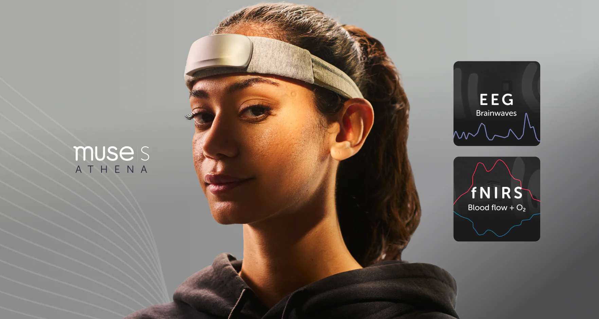
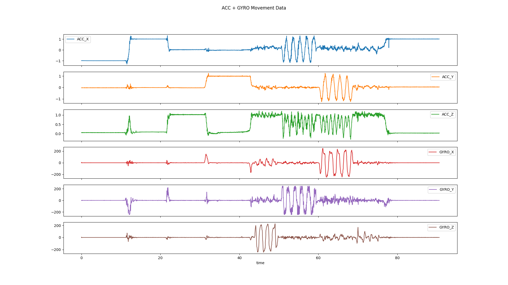

# OpenMuse

*The Open Python Muse S Athena EEG Decoder*

[](https://eu.choosemuse.com/products/muse-s-athena)


This software allows recording, streaming via LSL and visualizing signals from the **Muse S Athena** headband.

> [!WARNING]  
> OpenMuse is NOT an official product of InteraXon Inc and is not affiliated with or endorsed by the company. It does not come with any warranty and should be considered an experimental software developed for research purposes only.

## Installation

Install from GitHub by opening a terminal and running:

```powershell
pip install https://github.com/DominiqueMakowski/OpenMuse/zipball/main
```

## Usage

After installing the package, open a terminal and use the following commands:

### Find Muse devices

Power up the Muse S Athena headband (a blue light should appear on the front) and run:

```powershell
OpenMuse find
```

This will print the MAC addresses of nearby Muse devices. Note the address of your device for the next steps.


### Record data to a file

```powershell
OpenMuse record --address <your-muse-address> --duration 60 --outfile data.txt
```

> [!TIP]
> By default, recording and streaming use the `--preset p1041`, which enables all channels. You can change the preset using the `--preset` argument (see below for the list of documented presets).

Once your file is recorded, you can load it in Python using:

```python
import pandas as pd
import OpenMuse 

with open("data.txt", "r", encoding="utf-8") as f:
    messages = f.readlines()
data = OpenMuse.decode_rawdata(messages)

# Plot Movement Data
data["ACCGYRO"].plot(
    x="time",
    y=["ACC_X", "ACC_Y", "ACC_Z", "GYRO_X", "GYRO_Y", "GYRO_Z"],
    subplots=True
)
```



### Lab Streaming Layer (LSL)

> [!NOTE]  
> OpenMuse uses [MNE-LSL](https://mne.tools/mne-lsl/), an improved python-binding for the Lab Streaming Layer C++ library, `mne_lsl.lsl`, replacing `pylsl`.

To stream a file over LSL, use:

```powershell
OpenMuse stream --address <your-muse-address>
```

The following options are available:
- `--address`: The MAC address of your Muse device (required)
- `--duration`: Duration of the recording in seconds (if not specified, streaming will continue until you press Ctrl+C in the terminal)


To visualize a live LSL stream, open a new terminal (while the streaming is running) and run:

```powershell
OpenMuse view
```

## Technical Details

### Specs

Muse S Athena specs (From the [Muse website](https://eu.choosemuse.com/products/muse-s-athena)):
- Wireless Connection: BLE 5.3, 2.4 GHz
- EEG Channels: 4 EEG channels (TP9, AF7, AF8, TP10) + 4 amplified Aux channels
  - Sample Rate: 256 Hz
  - Sample Resolution: 14 bits / sample
- Accelerometer: Three-axis at 52Hz, 16-bit resolution, range +/- 2G
- Gyroscope: Three-axis at 52Hz, 16-bit resolution, range +/- 250dps
- PPG Sensor: Triple wavelength: IR (850nm), Near-IR (730nm), Red (660nm), 64 Hz sample rate, 20-bit resolution
- fNIRS Sensor: 5-optode bilateral frontal cortex hemodynamics, 64 Hz sample rate, 20-bit resolution

### Presets

| Presets                                 | EEG   | Optics   | ACC/GYRO | Battery | Red LED |
|-----------------------------------------|:-----:|:--------:|:--------:|:-------:|:--------|
| p20, p21, p50, p51, p60, p61            | EEG4  |          |    X     |    X    |   off   |
| p1034, p1043                            | EEG8  | Optics8  |    X     |    X    | bright  |
| p1044                                   | EEG8  | Optics8  |    X     |    X    |  dim    |
| p1035                                   | EEG4  | Optics4  |    X     |    X    |  dim    |
| p1041, p1042                            | EEG8  | Optics16 |    X     |    X    | bright  |
| p1045                                   | EEG8  | Optics4  |    X     |    X    |  dim    |
| p1046                                   | EEG8  | Optics4  |    X     |    X    |   —     |
| p4129                                   | EEG8  | Optics4  |    X     |    X    |  dim    |

*Table derived from the signature of the data packets present in the data. More presets could exist.*

### Acknowledgements

This project would not have been possible without the breakthroughs of [amused-Py](https://github.com/Amused-EEG/amused-py) that identified the communication protocol and [AbosaSzakal's parser](https://github.com/AbosaSzakal/MuseAthenaDataformatParser) who documented the data structure.